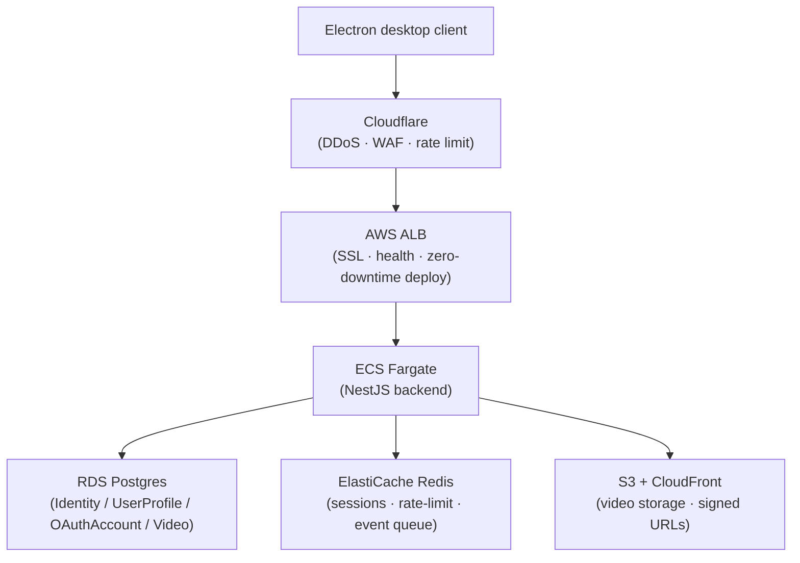
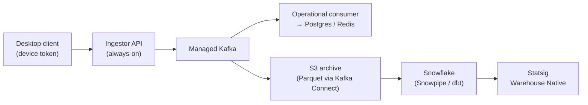
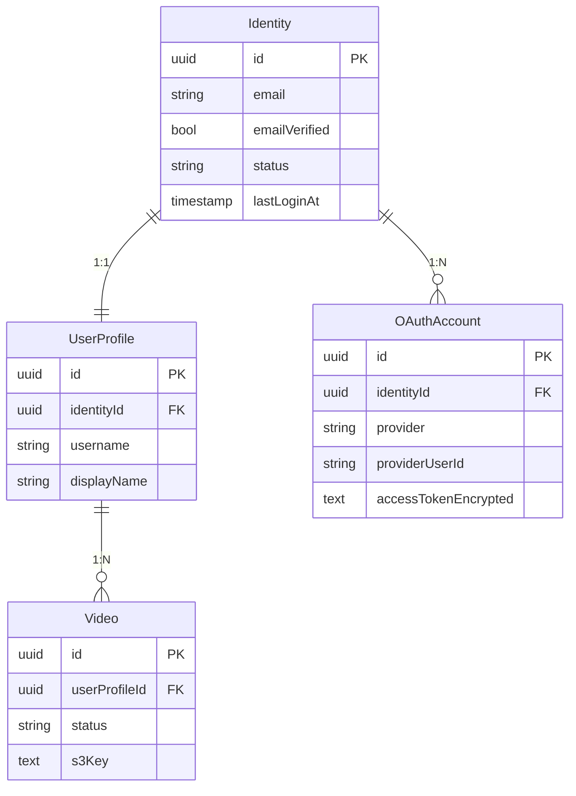
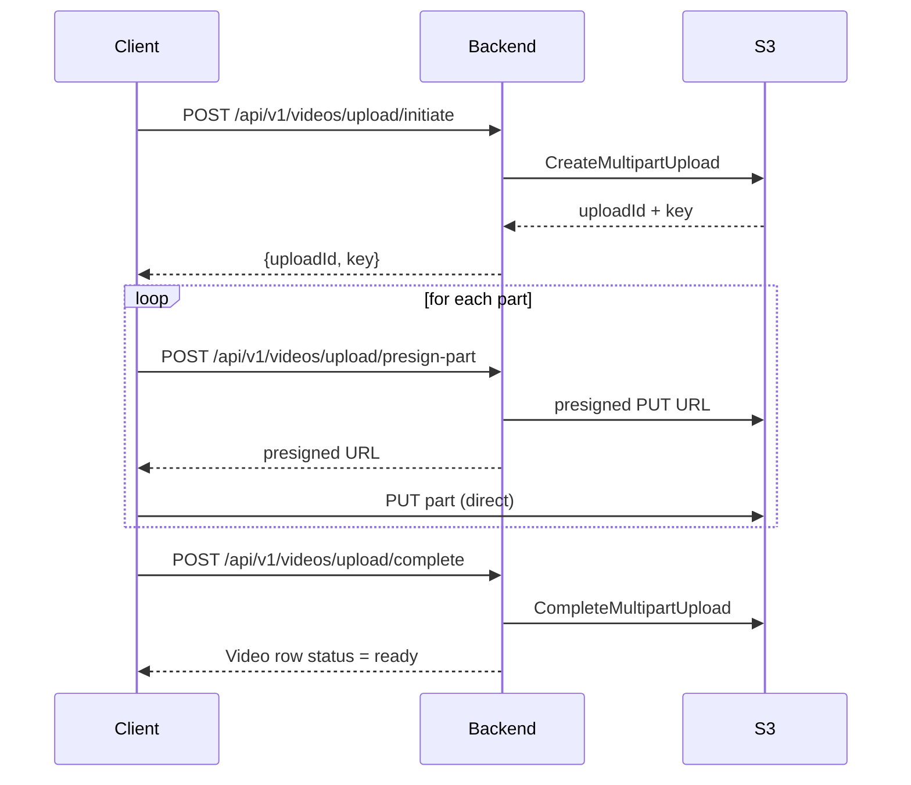

# Outplayed Backend — Architecture

What the backend looks like **today** (auth + session + video upload) and the **target system** it is evolving into (social platform with event pipeline). Rationale for individual decisions lives in [decisions.md](decisions.md).

Scope outside this doc:
- Feature-level specs → [features.md](features.md)
- Platform strategy and migration → [platform-strategy.md](platform-strategy.md)
- Phase-by-phase delivery plan → [production-roadmap.md](production-roadmap.md)
- Business case and cost model → [business-case.md](business-case.md)

---

## 1. System overview



**Event pipeline (target — scaffolded today with Go + DuckDB):**



Decisions: [D-001](decisions.md#d-001--auth-fully-self-managed-backend) · [D-002](decisions.md#d-002--analytics-warehouse-snowflake) · [D-003](decisions.md#d-003--experimentation--feature-flags-statsig-warehouse-native) · [D-004](decisions.md#d-004--observability-datadog) · [D-005](decisions.md#d-005--cloud-aws--cloudflare-edge) · [D-015](decisions.md#d-015--streaming-backbone-kafka-managed-over-kinesis)

---

## 2. Auth layer

### 2.1 Identity vs UserProfile

Two tables, 1:1 relationship. Rationale: [D-009](decisions.md#d-009--identity-vs-userprofile-separation).

| Identity (auth) | UserProfile (app) |
|---|---|
| id, email, emailVerified | id, identityId (FK) |
| passwordHash *(future)* | username, displayName |
| status: active / suspended / deleted | avatarUrl, bio |
| lastLoginAt | gamerTag, preferredGames[] |

OAuth providers link to **Identity** via `OAuthAccount`, never to UserProfile. One Identity can have multiple OAuthAccounts — e.g. Discord + Riot linked to the same user.

### 2.2 OAuth provider linking — 3-rule model

Full rationale: [D-008](decisions.md#d-008--oauth-provider-linking-3-rule-model).

1. **Rule 1** — `(provider, providerUserId)` already linked → update tokens, issue session.
2. **Rule 2** — no match → create new Identity + UserProfile + OAuthAccount.
3. **Rule 3** — verified email matches existing Identity → throw `LinkRequiredException`. User must log in to the existing account and explicitly link.

Unverified emails use a placeholder (`{providerId}@{provider}.placeholder`) and fall through to Rule 2.

### 2.3 Sessions

Server-side Redis sessions over JWT — [D-006](decisions.md#d-006--api-sessions-server-side-redis-sessions-over-jwt).

```typescript
interface Session {
  id: string;              // UUID, used as Bearer token
  identityId: string;
  profileId: string;
  provider: string;
  createdAt: number;
  lastActivityAt: number;
}
```

- **TTL:** sliding window, configurable via `SESSION_TTL_SECONDS` (default 24h).
- **Refresh:** `SessionGuard` updates `lastActivityAt` and extends TTL on every authenticated request.
- **Revocation:** delete the Redis key.

App session and provider OAuth tokens have **separate lifecycles**:

| | App session (Redis) | Provider token (Postgres / OAuthAccount) |
|---|---|---|
| TTL | 24h sliding | Provider-specific (~7d Discord) |
| Purpose | "Is user logged into *our* app?" | "Can we call the provider API?" |
| Refreshed | Every request | Lazily, on provider API call |

### 2.4 SessionGuard

`CanActivate` guard applied to every authenticated route.

- Reads `Authorization: Bearer <token>` header.
- Looks up session in the `CacheStore` (Redis in prod; in-memory for local).
- Refreshes the sliding-window TTL.
- Attaches `Session` to `req.session`. `@CurrentSession()` param decorator reads it in controllers.

---

## 3. Storage layer — env-swappable via DI

Rationale: [D-010](decisions.md#d-010--storage-layer-env-swappable-via-di).

```
CacheStore (interface)                    ← USE_REDIS toggle
  ├── InMemoryCacheService
  └── RedisCache

IdentityRepository (interface)            ← USE_POSTGRES toggle
  ├── IdentityRepository (InMemory)
  └── PrismaIdentityRepository

OAuthAccountRepository  (same pattern)
UserProfileRepository   (same pattern)
VideoRepository         (same pattern)
```

Each interface has a Nest DI token. `useFactory` in the owning module picks the implementation at startup. Zero code changes to swap.

**Invariant:** both implementations must be behaviorally identical for correctness-relevant operations. Both `findByEmail` implementations lowercase — verified by the case-insensitive spec in `identity.repository.spec.ts`.

---

## 4. Prisma schema

Three auth tables + Video.



Migrations in [backend/prisma/migrations/](../backend/prisma/migrations/). Apply with `npm run db:migrate`.

---

## 5. Request pipeline

```
HTTP request
  → LoggingMiddleware      (method, URL, status, duration)
  → Helmet / CORS
  → ValidationPipe         (whitelist, transform, fail on unknown keys)
  → [SessionGuard]         (on @UseGuards routes only)
  → [Throttler]            (per-route @Throttle decorators)
  → Controller
```

URI prefix `/api/v1/…` via `app.enableVersioning()`. See [D-011](decisions.md#d-011--api-protocol-rest-with-uri-versioning).

---

## 6. Video upload (S3 multipart)



- Storage abstraction: `VideoStorage` interface — `S3VideoStorage` for AWS and MinIO-compatible for local Docker.
- MIME whitelist + 10 GB cap enforced via DTO validation.
- Signed playback URLs issued by CloudFront OAC.
- Delete path: S3 delete + CloudFront invalidation (invalidation wiring pending — see [production-roadmap.md §6.3](production-roadmap.md)).

Storage decision: [D-014](decisions.md#d-014--video-object-storage-s3--cloudfront-oac).

---

## 7. Social data model (target)

Not yet implemented. Full schema in [features.md](features.md). Headline decisions:

- **`UserGame`** is a join table, not a `games_played[]` array on User — enables analytics segmentation.
- **`ClipViewCounts`** is an aggregates table; raw view rows are not written to OLTP.
- **`GameLeaderboard`** is materialized, refreshed on a schedule.
- **`Follow`** is directional. **`UserBlock`** is directional.
- Clip state: three orthogonal fields — `status` (pipeline), `deleted_at` (user soft-delete), `moderation_removed_at` (admin takedown).
- Counter consistency: [D-013](decisions.md#d-013--counter-consistency-sync-for-user-authored-async-for-aggregates) — sync for user-authored writes, async for aggregates.
- Feed at launch: pull-based at read time — [D-012](decisions.md#d-012--feed-architecture-at-launch-pull-based-at-read-time). Explicit migration path to materialized-per-user and fanout-on-write.

---

## 8. Event ingestion pipeline (target)

The Go services in [ingestor/](../ingestor/) and [consumer/](../consumer/) are **scaffolding** — they demonstrate the ingestion shape with Redis + DuckDB. The production design is the Kafka/Snowflake pipeline in the diagram above (§1).

Key design choices:
- Always-on containers, not Lambda — cold starts unacceptable at P99 100ms.
- Two topics with separate partition keys: `outplayed.events.client` (by `user_id`), `outplayed.events.social` (by `clip_id`).
- Device token on the ingestor path, not session token — decoupled from auth availability.
- Events are idempotency-key-deduplicated before Kafka produce.

Why Kafka not Kinesis: [D-015](decisions.md#d-015--streaming-backbone-kafka-managed-over-kinesis). Why Snowflake not ClickHouse: [D-002](decisions.md#d-002--analytics-warehouse-snowflake).

---

## 9. Ports

| Service | Port | Role |
|---------|------|------|
| Backend (NestJS) | 3001 | API |
| Frontend (Electron Forge dev) | 3000 | desktop client dev server |
| Ingestor (Go) | 3002 | scaffold HTTP → Redis event producer |
| Consumer (Go) | 3003 | scaffold Redis → DuckDB consumer + query API |
| Redis | 6379 | sessions + event queue |
| Postgres | 5432 | primary DB |
| MinIO | 9000 / 9001 | local S3-compatible video storage |

---

## 10. Security posture

- State parameter on all OAuth flows (CSRF).
- PKCE for Riot OAuth.
- `ValidationPipe` with `whitelist: true` — strips undecorated params.
- Masked email in `LinkRequiredException`.
- Placeholder emails for unverified OAuth addresses.
- Electron: context isolation + `contextBridge`, no direct Node API exposure.
- Session tokens in memory only (never localStorage).
- AES-256-GCM at-rest encryption of stored OAuth tokens — [D-019](decisions.md#d-019--oauth-token-encryption-aes-256-gcm-at-rest-decrypt-on-demand).
- Helmet middleware (CSP, HSTS, X-Frame-Options).
- URL-validated CORS origin parsing.
- Zod env validation at startup with placeholder-secret detection.
- `@nestjs/terminus` health/readiness endpoints for ALB probes.
- Prisma connection retry with exponential backoff on startup.
