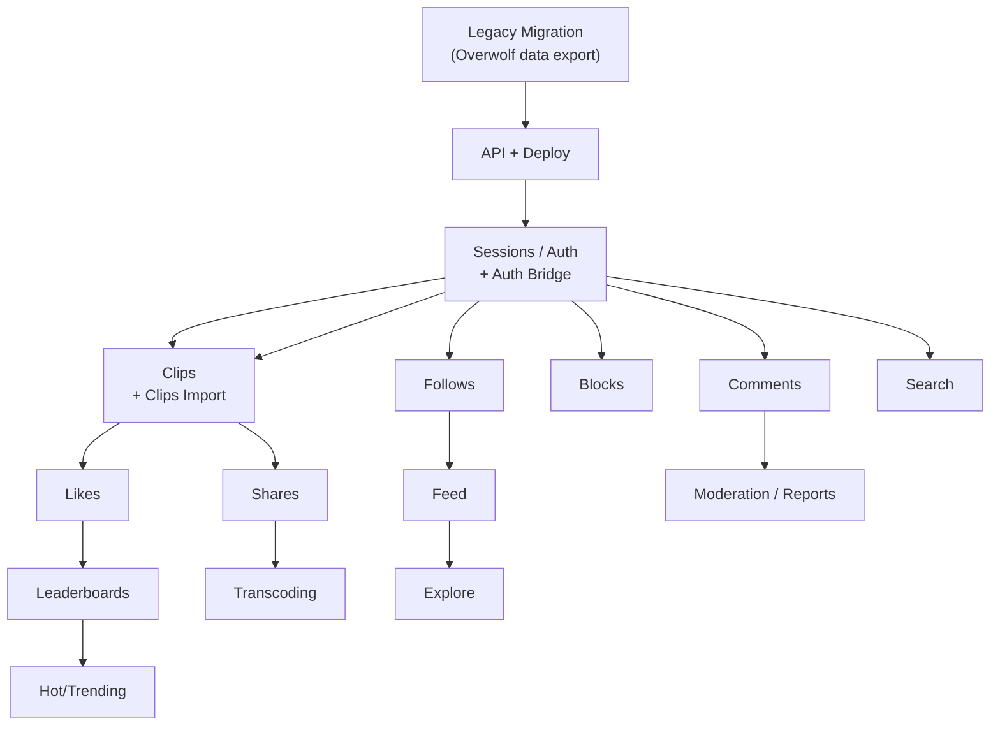

# Outplayed Backend — Feature Specifications

Deep technical specs. Each feature covers schema, API endpoints, event contracts, and scaling notes.

Read in conjunction with [architecture.md](architecture.md) for the current system and [decisions.md](decisions.md) for rationale.

**Work model:** Small investments, quick payoffs. Each feature ships independently with its minimum viable foundation.

---

## Pre-Condition: Legacy Migration

Outplayed has millions of existing users with clips stored in Overwolf's infrastructure. Both auth and clips require migration planning before new social features go live for existing users.

Three unknowns gate the migration plan — see [platform-strategy.md](platform-strategy.md#migration-blockers) and [decisions.md](decisions.md#migration-blockers-informational-not-decisions). Until resolved, new-user flow runs on self-managed auth (D-001) and existing-user migration is deferred.

### Migration Challenges

| Challenge | Description |
|-----------|-------------|
| **No direct clip ownership** | Clip storage URLs don't contain user IDs — mapping data must come from Overwolf |
| **Two identifier systems** | Overwolf account UUID vs provider-specific IDs — authoritative ID for clip ownership TBD |
| **Data export dependency** | Overwolf must provide user→clips mapping, or we implement a user-driven claim flow |

### Migration Strategy

**Phase 0: Data Acquisition (Overwolf dependency)**
- Request data export: `{ overwolf_user_id, clip_uuids[], profile_data }`
- Clarify which ID is authoritative for clip ownership
- Determine clip metadata availability (title, game, timestamps, visibility)

**Phase 1: Auth Migration**

```sql
-- Bridge table for transition period
CREATE TABLE overwolf_identity_bridge (
  overwolf_id       VARCHAR(255) PRIMARY KEY,
  identity_id       UUID REFERENCES identities(id),
  migrated_at       TIMESTAMP DEFAULT NOW(),
  migration_method  VARCHAR(20) NOT NULL  -- 'auto' | 'user_claimed'
);
```

Flow:
1. User logs in via Discord/Riot OAuth → new identity created
2. Client provides Overwolf identity confirmation (method TBD on handoff)
3. Backend links Overwolf ID to new identity via bridge table
4. All legacy data queryable via new identity

**Phase 2: Clips Migration**

Option A: **Bulk Import** (preferred if Overwolf provides data export)
```sql
INSERT INTO clips (id, user_id, ...)
SELECT
  c.clip_uuid,
  (SELECT up.id FROM user_profiles up
   JOIN overwolf_identity_bridge b ON b.identity_id = up.identity_id
   WHERE b.overwolf_id = c.overwolf_user_id),
  ...
FROM overwolf_export c;
```

Option B: **User-Driven Claim** (fallback if no data export)
- User authenticates with new identity
- User confirms "this is my account"
- System queries Overwolf API for user's clips (if API available)
- Clips associated with new identity

**Phase 3: Storage Migration**

| Approach | Description |
|----------|-------------|
| **Proxy (immediate)** | New system proxies to legacy storage for legacy clips |
| **Copy (eventual)** | Background job copies legacy clips to new storage |
| **Redirect (cleanup)** | After copy, serve legacy URLs via redirect to new location |

### Database Schema Additions

**Table: `overwolf_identity_bridge`** *(temporary, migration only)*
```sql
overwolf_id       VARCHAR(255) PRIMARY KEY
identity_id       UUID REFERENCES identities(id)
overwolf_email    VARCHAR(255)
overwolf_username VARCHAR(255)
migrated_at       TIMESTAMP DEFAULT NOW()
migration_method  VARCHAR(20) NOT NULL
```

**Table: `legacy_clips`** *(tracks migration status)*
```sql
clip_uuid         UUID PRIMARY KEY
overwolf_user_id  VARCHAR(255) NOT NULL
legacy_url        TEXT NOT NULL
migrated_to       UUID REFERENCES clips(id)
migrated_at       TIMESTAMP
status            VARCHAR(20) DEFAULT 'pending'  -- pending | migrated | failed | orphaned
```

### Migration Timeline Estimate

| Phase | Duration | Dependency |
|-------|----------|------------|
| Data acquisition | 2–4 weeks | Overwolf cooperation |
| Auth bridge implementation | 2 weeks | Data format confirmed |
| Clips import pipeline | 3 weeks | Auth bridge complete |
| Storage proxy/copy | 2 weeks | Clips imported |
| Parallel operation | 4–8 weeks | All systems running |
| Cutover | 1 week | Confidence threshold met |

**Total: 14–20 weeks** (heavily dependent on Overwolf data availability)

---

## Foundation Layer

| Component | Details |
|-----------|---------|
| **API Runtime** | NestJS / TypeScript on ECS Fargate |
| **CDN** | Cloudflare (edge caching, DDoS, WAF) |
| **IaC** | Terraform + Terragrunt |
| **CI/CD** | GitLab: lint → test → build → deploy |
| **Environments** | Local (Docker Compose) → Dev → Staging → Production |
| **PostgreSQL** | RDS PostgreSQL Multi-AZ |
| **Redis** | ElastiCache (sessions, OAuth state, event dedup, rate limiting) |
| **Warehouse** | Snowflake (existing Overwolf infrastructure) |

---

## Feature: Sessions & Auth

Foundation for all user-specific features. Self-managed auth with Discord/Riot OAuth.

### Design Principles

**Identity vs Profile separation:** Auth concerns (who you are, how you prove it) are separate from application concerns (username, avatar, social graph). See [D-009](decisions.md#d-009--identity-vs-userprofile-separation).

**OAuth-first:** Discord and Riot are the primary login methods. If email/password is needed later, add a `credentials` table — don't bolt it onto Identity.

### Database Schema

**Table: `identities`**
```sql
id             UUID PRIMARY KEY
email          VARCHAR(255) UNIQUE      -- nullable; NULLs don't conflict in Postgres
email_verified BOOLEAN DEFAULT false
status         VARCHAR(20) DEFAULT 'active'  -- active | suspended | deleted
last_login_at  TIMESTAMP
created_at     TIMESTAMP DEFAULT NOW()
updated_at     TIMESTAMP DEFAULT NOW()
deleted_at     TIMESTAMP
```

**Table: `oauth_accounts`**
```sql
id                      UUID PRIMARY KEY
identity_id             UUID REFERENCES identities(id) NOT NULL
provider                VARCHAR(20) NOT NULL  -- 'discord' | 'riot'
provider_user_id        VARCHAR(255) NOT NULL
provider_username       VARCHAR(255)
provider_email          VARCHAR(255)
access_token_encrypted  TEXT NOT NULL
refresh_token_encrypted TEXT
token_expires_at        TIMESTAMP
scopes                  TEXT[]
metadata                JSONB DEFAULT '{}'
created_at              TIMESTAMP DEFAULT NOW()
updated_at              TIMESTAMP DEFAULT NOW()
UNIQUE (provider, provider_user_id)
```

**Table: `user_profiles`**
```sql
id                   UUID PRIMARY KEY
identity_id          UUID UNIQUE REFERENCES identities(id) NOT NULL
username             VARCHAR(30) UNIQUE NOT NULL
display_name         VARCHAR(100)
avatar_url           TEXT
bio                  TEXT
gamer_tag            VARCHAR(50)
follower_count       INTEGER DEFAULT 0       -- eventual (operational pipeline)
following_count      INTEGER DEFAULT 0       -- eventual (operational pipeline)
clips_public_count   INTEGER DEFAULT 0       -- eventual (operational pipeline)
total_likes_received INTEGER DEFAULT 0       -- eventual (operational pipeline)
last_active_at       TIMESTAMP
created_at           TIMESTAMP DEFAULT NOW()
updated_at           TIMESTAMP DEFAULT NOW()
```

**Table: `user_games`**
```sql
user_id        UUID REFERENCES user_profiles(id)
game_name      VARCHAR(100) NOT NULL
last_played_at TIMESTAMP
sessions_count INTEGER DEFAULT 1
PRIMARY KEY (user_id, game_name)
```

### Session Storage

Opaque session token (UUID) → Redis lookup. Sliding-window TTL (24h default). See [D-006](decisions.md#d-006--api-sessions-server-side-redis-sessions-over-jwt).

```typescript
interface Session {
  id: string;
  identityId: string;
  profileId: string;
  provider: 'discord' | 'riot';
  createdAt: number;
  lastActivityAt: number;
}
```

### OAuth State Store

CSRF protection for OAuth flows. Stored in Redis with 10-minute TTL.

```typescript
interface OAuthState {
  redirectUrl?: string;
  linkToIdentityId?: string;   // explicit account linking
  codeVerifier?: string;       // PKCE (Riot only)
}
```

### Three-Rule OAuth Flow

See [D-008](decisions.md#d-008--oauth-provider-linking-3-rule-model).

| Rule | Condition | Action |
|------|-----------|--------|
| **1** | `(provider, provider_user_id)` already linked | Login: update tokens, update `last_login_at`, return session |
| **2** | No match, no email collision | Signup: create Identity → UserProfile → OAuthAccount → return session |
| **3** | No match, verified email matches existing Identity | Require explicit link: throw `LinkRequiredException` |

### Provider-Specific Notes

**Discord OAuth 2.0**
- Scopes: `identify`, `email`
- Email may be unverified or missing

**Riot Sign-On (RSO)**
- Scopes: `openid`, `offline_access`
- **PKCE required** (S256 code challenge)
- No email provided
- Username = `gameName#tagLine`

**Vendor approval:** Basic profile scopes available immediately. Additional scopes (relationships, social graphs) require vendor partnership approval.

### Indexes

| Table | Columns | Purpose |
|-------|---------|---------|
| `identities` | `(email)` | Email lookup for Rule 3 |
| `oauth_accounts` | `(provider, provider_user_id)` UNIQUE | Provider login lookup |
| `oauth_accounts` | `(identity_id)` | List linked accounts |
| `user_profiles` | `(identity_id)` UNIQUE | Profile lookup |
| `user_profiles` | `(username)` UNIQUE | Username lookup |
| `user_games` | `(user_id)` | Load games for Statsig |
| `user_games` | `(game_name, last_played_at DESC)` | Find players by game |

### API Endpoints

| Method | Endpoint | Auth | Description |
|--------|----------|------|-------------|
| GET | `/v1/oauth/{provider}` | None | Redirect to provider auth URL |
| GET | `/v1/oauth/{provider}/callback` | None | Handle callback, return session |
| GET | `/v1/oauth/{provider}/link` | Bearer | Link additional provider to current identity |
| GET | `/v1/sessions/current` | Bearer | Session state (profile, linked accounts, flags) |
| DELETE | `/v1/sessions/current` | Bearer | Logout |
| GET | `/v1/users/{userId}` | Optional | Get profile |
| GET | `/v1/users/me` | Bearer | Own profile + linked accounts |
| PATCH | `/v1/users/me` | Bearer | Update profile |
| DELETE | `/v1/users/me/oauth/{provider}` | Bearer | Unlink provider |

### Kafka Events

| Event | Topic | Partition Key |
|-------|-------|---------------|
| `session.app_opened` | `outplayed.events.client` | `user_id` |
| `session.game_detected` | `outplayed.events.client` | `user_id` |

### Operational Pipeline

| Event | Action |
|-------|--------|
| `session.app_opened` | Update `user_profiles.last_active_at` |
| `session.game_detected` | Upsert `user_games` |

---

## Feature: Clips

Central content entity.

### Database Schema

**Table: `clips`**
```sql
id                    UUID PRIMARY KEY
user_id               UUID REFERENCES user_profiles(id) NOT NULL
game_name             VARCHAR(100) NOT NULL
title                 VARCHAR(200)
description           TEXT
file_url              TEXT
thumbnail_url         TEXT
duration_seconds      INTEGER
quality_preset        VARCHAR(20)
visibility            VARCHAR(10) DEFAULT 'private'  -- public | private
status                VARCHAR(20) DEFAULT 'pending_upload'  -- pending_upload | processing | ready
deleted_at            TIMESTAMP
moderation_removed_at TIMESTAMP
game_event_tags       TEXT[]
hashtags              TEXT[]
like_count            INTEGER DEFAULT 0   -- sync write
comment_count         INTEGER DEFAULT 0   -- sync write
hotness_score         FLOAT DEFAULT 0     -- background job
created_at            TIMESTAMP DEFAULT NOW()
updated_at            TIMESTAMP DEFAULT NOW()
```

**Table: `clip_view_counts`**
```sql
clip_id        UUID PRIMARY KEY REFERENCES clips(id)
views_last_24h INTEGER DEFAULT 0
views_total    INTEGER DEFAULT 0
updated_at     TIMESTAMP
```

### Indexes

| Columns | Condition | Purpose |
|---------|-----------|---------|
| `(user_id, created_at DESC)` | `status='ready' AND visibility='public' AND deleted_at IS NULL AND moderation_removed_at IS NULL` | Feed |
| `(hotness_score DESC)` | same | Explore |
| `(game_name, hotness_score DESC)` | same | Explore by game |
| `(game_name, like_count DESC)` | same | Leaderboard job |

### API Endpoints

| Method | Endpoint | Auth | Cache | Description |
|--------|----------|------|-------|-------------|
| POST | `/v1/clips` | Bearer | No | Create clip, return `{clip, upload_url}` |
| GET | `/v1/clips` | Optional | CDN 60s | List/explore. `?sort=&game=&cursor=` |
| GET | `/v1/clips/{clipId}` | Optional | CDN 30s | Get clip |
| PATCH | `/v1/clips/{clipId}` | Bearer (owner) | No | Update |
| DELETE | `/v1/clips/{clipId}` | Bearer (owner) | No | Soft-delete |
| GET | `/v1/users/{userId}/clips` | Optional | CDN 30s | User's clips |

### Kafka Events

| Event | Topic | Partition Key |
|-------|-------|---------------|
| `clip.captured` | `outplayed.events.client` | `user_id` |
| `clip.published` | `outplayed.events.client` | `user_id` |
| `social.clip_viewed` | `outplayed.events.social` | `clip_id` |

### Operational Pipeline

| Event | Action |
|-------|--------|
| `clip.published` | Increment `user_profiles.clips_public_count` |
| `social.clip_viewed` | Batch (60s): update `clip_view_counts` |

### Background Jobs

| Job | Schedule | Purpose |
|-----|----------|---------|
| Hotness score | 5 min | `(views * w_v + likes * w_l) / (hours + 2)^gravity` |

### Storage Layout

```
outplayed-clips/raw/{userId}/{clipId}.mp4
outplayed-clips/clips/{userId}/{clipId}.mp4
outplayed-clips/thumbnails/{userId}/{clipId}.jpg
```

---

## Feature: Likes

User appreciation signal. Sync writes + client debounce.

### Database Schema

**Table: `likes`**
```sql
user_id    UUID REFERENCES user_profiles(id)
clip_id    UUID REFERENCES clips(id)
created_at TIMESTAMP DEFAULT NOW()
PRIMARY KEY (user_id, clip_id)
```

### Write Pattern

```sql
BEGIN;
INSERT INTO likes (user_id, clip_id) VALUES ($1, $2) ON CONFLICT DO NOTHING;
UPDATE clips SET like_count = like_count + 1 WHERE id = $2;
COMMIT;
```

Client debounces 300ms. Backend handles idempotently.

### API Endpoints

| Method | Endpoint | Auth | Description |
|--------|----------|------|-------------|
| POST | `/v1/clips/{clipId}/likes` | Bearer | Like. Returns `{like_count}` |
| DELETE | `/v1/clips/{clipId}/likes` | Bearer | Unlike. Returns `{like_count}` |
| GET | `/v1/clips/{clipId}/likes` | Optional | List likers (paginated) |

### Kafka Events

| Event | Topic | Partition Key |
|-------|-------|---------------|
| `social.clip_liked` | `outplayed.events.social` | `clip_id` |
| `social.clip_unliked` | `outplayed.events.social` | `clip_id` |

### Rate Limiting

60 actions/minute per user via Redis sliding window.

---

## Feature: Follows

Social graph.

### Database Schema

**Table: `follows`**
```sql
follower_id UUID REFERENCES user_profiles(id)
followee_id UUID REFERENCES user_profiles(id)
created_at  TIMESTAMP DEFAULT NOW()
PRIMARY KEY (follower_id, followee_id)
```

### API Endpoints

| Method | Endpoint | Auth | Cache |
|--------|----------|------|-------|
| GET | `/v1/users/{userId}/followers` | Optional | CDN 30s |
| POST | `/v1/users/{userId}/followers` | Bearer | No |
| DELETE | `/v1/users/{userId}/followers` | Bearer | No |
| GET | `/v1/users/{userId}/following` | Optional | CDN 30s |

### Kafka Events

| Event | Topic |
|-------|-------|
| `social.user_followed` | `outplayed.events.client` |
| `social.user_unfollowed` | `outplayed.events.client` |

### Operational Pipeline

Update `follower_count` and `following_count` (eventual consistency, 30–60s). See [D-013](decisions.md#d-013--counter-consistency-sync-for-user-authored-async-for-aggregates).

---

## Feature: Blocks

Safety — affects feed, profile visibility, follows.

### Database Schema

**Table: `user_blocks`**
```sql
blocker_id UUID REFERENCES user_profiles(id)
blocked_id UUID REFERENCES user_profiles(id)
created_at TIMESTAMP DEFAULT NOW()
PRIMARY KEY (blocker_id, blocked_id)
```

### Side Effects (Same Transaction)

1. Create block
2. Delete any follow relationships (both directions)
3. Emit events for counter updates

### Query Filter

All feeds/explore must include:
```sql
AND user_id NOT IN (SELECT blocked_id FROM user_blocks WHERE blocker_id = $me)
```

Blocked user sees `404` (not `403`).

### API Endpoints

| Method | Endpoint | Auth |
|--------|----------|------|
| POST | `/v1/users/{userId}/blocks` | Bearer |
| DELETE | `/v1/users/{userId}/blocks` | Bearer |
| GET | `/v1/users/me/blocks` | Bearer |

---

## Feature: Feed

Personalized content from followed users.

### Query (Pull-based at launch — D-012)

```sql
SELECT c.* FROM clips c
WHERE c.user_id IN (SELECT followee_id FROM follows WHERE follower_id = $me)
  AND c.status = 'ready' AND c.visibility = 'public'
  AND c.deleted_at IS NULL AND c.moderation_removed_at IS NULL
  AND c.user_id NOT IN (SELECT blocked_id FROM user_blocks WHERE blocker_id = $me)
ORDER BY c.created_at DESC
LIMIT 20
```

### Sort Modes

| Sort | ORDER BY |
|------|----------|
| `newest` | `created_at DESC` |
| `top` | `like_count DESC` |
| `hottest` | `hotness_score DESC` |

### API Endpoints

| Method | Endpoint | Auth |
|--------|----------|------|
| GET | `/v1/feed?sort=newest&cursor=&limit=20` | Bearer |

Cursor = base64(`sort_key`, `id`).

### Scaling Path

~500 follows → materialized feed table → fanout-on-write. See [D-012](decisions.md#d-012--feed-architecture-at-launch-pull-based-at-read-time).

---

## Feature: Leaderboards

Game-specific rankings.

### Database Schema

**Table: `game_leaderboards`**
```sql
game        VARCHAR(100) NOT NULL
clip_id     UUID REFERENCES clips(id)
user_id     UUID REFERENCES user_profiles(id)
score       INTEGER NOT NULL
rank        INTEGER NOT NULL
period      VARCHAR(10) NOT NULL  -- weekly | monthly | alltime
computed_at TIMESTAMP DEFAULT NOW()
PRIMARY KEY (game, period, rank)
```

Background job every 10 min: query top clips per game/period, write with ranks.

### API Endpoints

| Method | Endpoint | Auth | Cache |
|--------|----------|------|-------|
| GET | `/v1/games/{gameName}/leaderboard?period=weekly` | None | CDN 60s |
| GET | `/v1/users/me/friends-leaderboard` | Bearer | No |

---

## Feature: Comments

Discussion on clips.

### Database Schema

**Table: `comments`**
```sql
id         UUID PRIMARY KEY
clip_id    UUID REFERENCES clips(id) NOT NULL
user_id    UUID REFERENCES user_profiles(id) NOT NULL
parent_id  UUID REFERENCES comments(id)
body       TEXT NOT NULL
created_at TIMESTAMP DEFAULT NOW()
deleted_at TIMESTAMP
```

Sync: insert comment + increment `clips.comment_count` in same transaction.

### API Endpoints

| Method | Endpoint | Auth |
|--------|----------|------|
| GET | `/v1/clips/{clipId}/comments` | Optional |
| POST | `/v1/clips/{clipId}/comments` | Bearer |
| DELETE | `/v1/clips/{clipId}/comments/{commentId}` | Bearer (owner) |

---

## Feature: Reports & Moderation

**Table: `reports`**
```sql
id            UUID PRIMARY KEY
reporter_id   UUID REFERENCES user_profiles(id) NOT NULL
reported_type VARCHAR(10) NOT NULL  -- user | clip | comment
reported_id   UUID NOT NULL
reason        VARCHAR(30) NOT NULL  -- spam | harassment | inappropriate_content | impersonation | other
status        VARCHAR(20) DEFAULT 'pending'  -- pending | reviewed | actioned | dismissed
reviewed_by   UUID REFERENCES user_profiles(id)
created_at    TIMESTAMP DEFAULT NOW()
reviewed_at   TIMESTAMP
UNIQUE (reporter_id, reported_type, reported_id)
```

### API Endpoints

| Method | Endpoint | Auth | Response |
|--------|----------|------|----------|
| POST | `/v1/clips/{clipId}/reports` | Bearer | 201 or 409 |
| POST | `/v1/users/{userId}/reports` | Bearer | 201 or 409 |
| POST | `/v1/clips/{clipId}/comments/{commentId}/reports` | Bearer | 201 or 409 |

### Admin Actions

- Clip takedown: set `moderation_removed_at`, purge CDN
- User suspend: set `identities.status = 'suspended'`
- User ban: set `identities.status = 'deleted'`, bulk soft-delete content

---

## Feature: External Share

**Table: `shares`**
```sql
id         UUID PRIMARY KEY
clip_id    UUID REFERENCES clips(id) NOT NULL
user_id    UUID REFERENCES user_profiles(id) NOT NULL
platform   VARCHAR(20) NOT NULL  -- discord | twitter | youtube | instagram | other
created_at TIMESTAMP DEFAULT NOW()
```

| Method | Endpoint | Auth | Returns |
|--------|----------|------|---------|
| POST | `/v1/clips/{clipId}/shares` | Bearer | `{share_url}` |

---

## Feature: Search

### Phase 1: PostgreSQL pg_trgm

```sql
CREATE EXTENSION IF NOT EXISTS pg_trgm;
CREATE INDEX ON user_profiles USING gin(username gin_trgm_ops);
CREATE INDEX ON user_profiles USING gin(display_name gin_trgm_ops);
CREATE INDEX ON clips USING gin(title gin_trgm_ops);
```

### Phase 2: Typesense/Algolia

When relevance or latency becomes a problem.

| Method | Endpoint | Auth | Cache |
|--------|----------|------|-------|
| GET | `/v1/search/users?q=` | Optional | No |
| GET | `/v1/search/clips?q=&game=&hashtag=` | Optional | CDN 30s |

---

## Feature: A/B Testing (Statsig)

See [D-003](decisions.md#d-003--experimentation--feature-flags-statsig-warehouse-native).

**Flow:**
1. OAuth callback or session refresh
2. Server loads `user_games` from Postgres
3. Server calls Statsig SDK with user attributes
4. Returns experiments + flags in session response
5. Client bakes into every event envelope

**Fallback:** if Statsig down — return empty assignments, flags default-off. Never fail session.

---

## Feature: Video Transcoding

Conditional on observed need.

**Flow:**
1. `POST /v1/clips` → `{clip, upload_url}`
2. Client uploads directly via pre-signed URL
3. Storage event triggers transcoding job
4. FFmpeg worker: download → transcode → thumbnail → upload
5. Update `clips.file_url`, `thumbnail_url`, `status = 'ready'`

Infrastructure: FFmpeg containers, autoscale on queue depth (KEDA). Job queue: Kafka or SQS.

---

## Kafka Topics

| Topic | Partition Key | Events |
|-------|---------------|--------|
| `outplayed.events.client` | `user_id` | session.*, clip.*, social.user_*, social.comment_*, ui.*, experiment.* |
| `outplayed.events.social` | `clip_id` | social.clip_viewed, social.clip_liked, social.clip_unliked, social.clip_shared_externally |
| `outplayed.events.dlq` | — | Failed events |

---

## Operational Pipeline

| Event | Action | Latency |
|-------|--------|---------|
| `session.app_opened` | Update `user_profiles.last_active_at` | 30–60s |
| `session.game_detected` | Upsert `user_games` | 30–60s |
| `social.user_followed` | Increment follower/following counts | 30–60s |
| `clip.published` | Increment `user_profiles.clips_public_count` | 30–60s |
| `social.clip_viewed` | Batch update `clip_view_counts` | 60s |
| `social.clip_liked` | Increment `user_profiles.total_likes_received` | 30–60s |

---

## Background Jobs

| Job | Schedule | Purpose |
|-----|----------|---------|
| Hotness score | 5 min | Compute `clips.hotness_score` |
| Leaderboard | 10 min | Populate `game_leaderboards` |
| Hashtag trending | Hourly | Top hashtags by clip count |
| Search reconciliation | Daily | Repair Postgres ↔ search index drift |
| dbt models | Hourly/daily | Transform events in Snowflake |

---

## Dependency Graph


